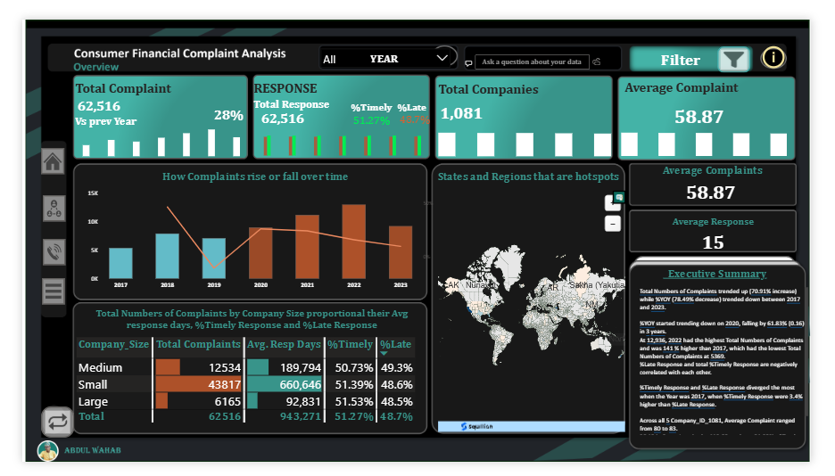
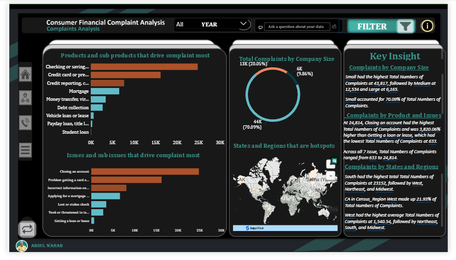
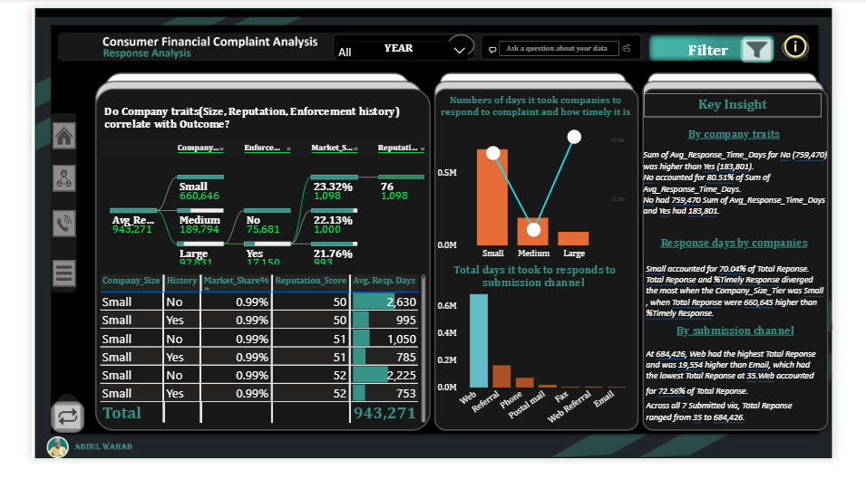
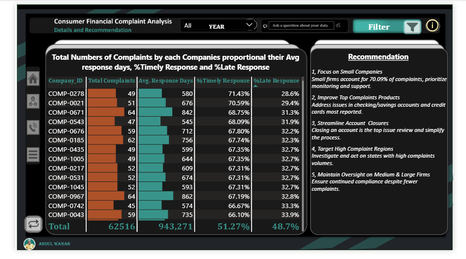

# Consumer-Financial-Complaints-Analytics-CFPB
An analytical study of consumer financial complaints data from the Consumer Financial Protection Bureau (CFPB), conducted to identify service gaps, response inefficiencies, and high-risk segments, in order to support regulatory decision-making and improve financial service delivery.
# Consumer Financial Complaints Analytics

## Executive Overview

This project analyzes **62,516 consumer financial complaints** within a regulatory context to uncover patterns in customer dissatisfaction, company response behavior, and operational risk across the financial sector.

**Organization:** Consumer Financial Protection Bureau (CFPB)  
**Analytical Context:** Supporting regulatory oversight and improving responsible lending practices (Nova Bank perspective)

The analysis reveals a **28% increase in complaints**, strong concentration among **small companies (70.09%)**, and a near-even split between **timely (51.27%) and late (48.7%) responses** — indicating systemic inefficiencies in complaint handling and service delivery.

---

## Business Problem

Consumer complaints provide a direct signal of breakdowns in financial products and services. However, without structured analysis, these signals remain underutilized.

The key challenge is to:
- identify where complaints are concentrated,
- understand what drives them,
- evaluate how effectively companies respond,
- and translate these patterns into actionable regulatory and business decisions.

---

## Business Questions

- How do complaint volumes change over time?
- Which regions and states show the highest concentration?
- Which financial products drive the most complaints?
- What issue types indicate the most critical service failures?
- How timely are company responses?
- Do company characteristics (such as size) influence complaint patterns?
- Does submission channel affect outcomes?

---

## Key Performance Indicators (KPIs)

- **Total Complaints:** 62,516  
- **Year-over-Year Change:** +28%  
- **Total Companies:** 1,081  
- **Average Complaints per Company:** 58.87  
- **Timely Responses:** 51.27%  
- **Late Responses:** 48.7%  
- **Small Company Complaints:** 70.09% of total  

---

## Dashboard Walkthrough

---

## Overview of Complaint Trends and System Performance

This section provides a high-level perspective on complaint volume, company participation, and response behavior over time. The focus is on identifying overall trends and assessing whether operational response systems are keeping pace with increasing complaint activity.

**Insight:**  
The analysis indicates a sustained upward trend in complaint volumes, with a significant 28% year-over-year increase, reflecting growing pressure within the financial services ecosystem. While fluctuations exist across years, the sharp rise toward 2022 suggests structural or behavioral shifts in customer engagement or reporting. Response performance remains nearly evenly split between timely and late responses, pointing to systemic inefficiencies rather than isolated service gaps.

---

## Complaint Concentration Across Products, Issues, and Company Size

This section examines how complaints are distributed across company sizes, financial products, and issue categories, with the goal of identifying concentration points and underlying drivers of customer dissatisfaction.

**Insight:**  
A clear concentration emerges among small-sized companies, which account for the majority of total complaints, suggesting operational limitations in handling customer issues at scale. Complaint activity is heavily driven by core financial products such as checking accounts and credit reporting, where trust and accuracy are critical. The dominance of account-related issues—particularly closures and incorrect information—points to systemic process breakdowns rather than isolated service failures.

---

## Response Efficiency and Operational Behavior

This section evaluates response performance, focusing on timeliness, response distribution, and submission channels to assess how effectively complaints are being managed.

**Insight:**  
The response framework appears structurally inconsistent, with timely and late responses nearly balanced, indicating uneven service delivery across the system. Smaller companies contribute significantly to both complaint volume and response workload, reinforcing their central role in operational pressure. The strong reliance on web-based submission channels highlights a digital-first complaint pipeline, which, while scalable, may also introduce processing bottlenecks if not supported by efficient backend systems.

---

##  Strategic Insights and Recommendations

This section translates the analytical findings into actionable insights, focusing on addressing root causes of complaints and improving response effectiveness across the system.

**Insight:**  
The findings highlight the need for targeted operational improvements, particularly within smaller institutions where complaint concentration is highest. Strengthening account management processes and improving data accuracy in high-risk product categories could significantly reduce complaint volumes. Additionally, enhancing response infrastructure—especially for digitally submitted complaints—is critical to addressing delays and improving overall customer experience.

## Analytical Insights

Complaint activity is not evenly distributed. It is concentrated in specific company segments, product categories, and operational processes.

- **Complaint growth signals rising consumer pressure**  
  The 28% increase suggests worsening customer experience or increased reporting behavior rather than stability.

- **Small companies are the primary risk cluster**  
  With over 70% of complaints, smaller institutions likely face operational and compliance limitations, making them key targets for regulatory focus.

- **Response performance is inconsistent**  
  The near 50/50 split between timely and late responses indicates unreliable complaint resolution processes.

- **Core financial services drive most complaints**  
  Checking/savings accounts, credit reporting, mortgage, money transfer services, and debt collection dominate complaint volume — pointing to friction in essential consumer services.

- **Account access and closure issues reflect operational breakdowns**  
  Recurring themes suggest problems in customer control, account management, and service processes.

- **Regional patterns show uneven risk distribution**  
  The South leads in total complaints, while the West shows higher average complaints, indicating different types of regional pressure.

- **Digital channels dominate complaint submission**  
  The web as the primary channel highlights the importance of efficient digital complaint handling systems.

## Recommendations

- **Target high-risk segments**  
  Prioritize regulatory attention on small companies with high complaint concentration.

- **Improve complaint response systems**  
  Strengthen tracking and escalation processes to reduce late responses.

- **Address core service failures**  
  Focus on account access, account closure, and credit-related issues.

- **Use complaints as an early warning system**  
  Monitor complaint spikes to identify emerging risks.

- **Enhance digital complaint handling**  
  Optimize web-based systems for faster and more transparent resolution.

---

## Dashboard Preview

